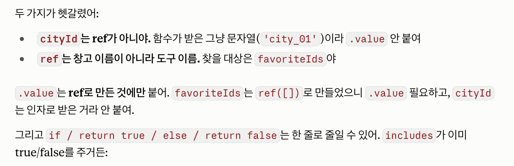
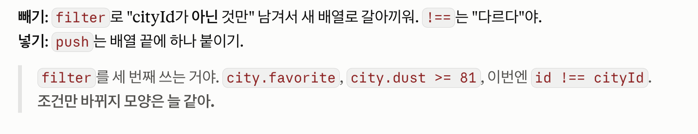
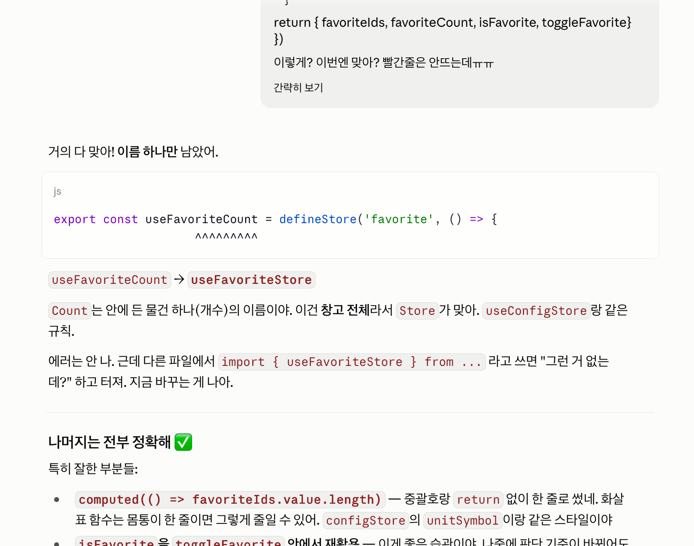
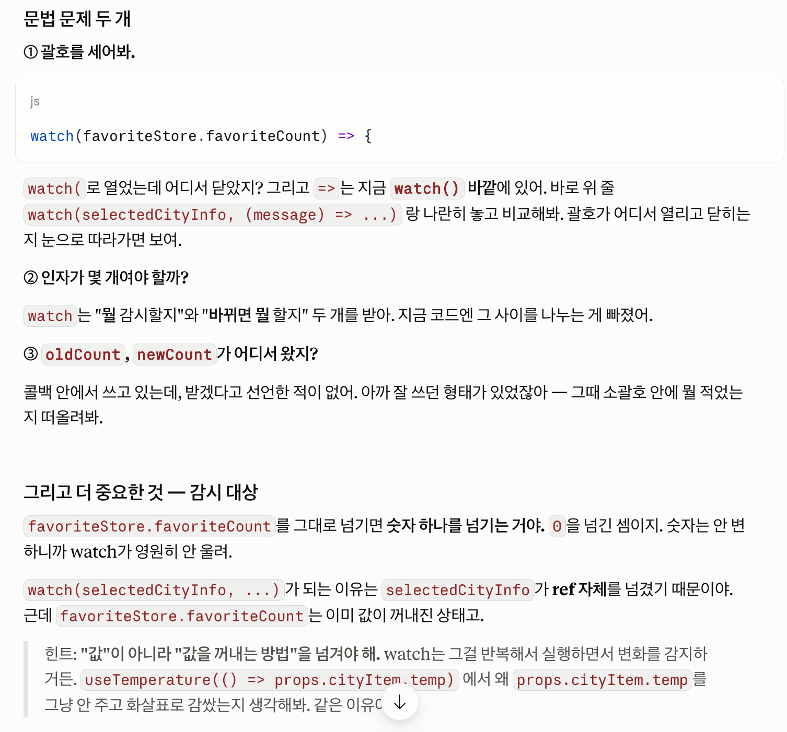

# Vue Weather Dashboard

Vue 3 Composition API 기반 날씨 대시보드. OpenWeather와 Open-Meteo API를 연동해
5개 도시(서울·수원·부산·고양·성남)의 실시간 날씨, 미세먼지, 내일 예보를 제공합니다.

- **배포 주소**: https://skala-practice.vercel.app
- **저장소**: https://github.com/ahrdyrxkddhfl/SKALA-practice/tree/main/0824-27_front_vue

---

## 실행 방법

```bash
npm install
```

프로젝트 루트에 `.env.local` 파일을 만들고 OpenWeather API 키를 입력합니다. (`.env.example` 참고)

```
VITE_OPENWEATHER_API_KEY=발급받은_키
```

```bash
npm run dev      # 개발 서버 (localhost:3000)
npm run lint     # ESLint 검사
npm run format   # Prettier 정렬
npm run build    # 프로덕션 빌드 → dist/
npm run preview  # 빌드 결과 미리보기
```

> `.env.local` 수정 후에는 개발 서버를 재시작해야 반영됩니다.

---

## 구현 기능

| 경로               | 화면                                       |
| ------------------ | ------------------------------------------ |
| `/`                | 지역별 날씨 목록, 도시 검색, 즐겨찾기 필터 |
| `/weather/:cityId` | 도시 상세 날씨                             |
| `/favorite`        | 즐겨찾기한 도시 모아보기                   |
| `/about`           | 서비스 소개                                |
| 그 외              | 404 화면                                   |

- **검색**: 한글 IME를 고려한 `:value` + `@input` 조합, computed 필터링
- **즐겨찾기**: Pinia Store로 전역 관리, 목록 페이지와 상세 페이지가 상태 공유
- **온도 단위 전환**: 섭씨/화씨 토글, 모든 화면에 동시 적용
- **미세먼지 등급**: PM10 수치를 한국 환경기준 3단계로 표시
- **내일 예보**: Open-Meteo에서 최고/최저 기온 조회
- **로딩·오류 처리**: API 호출 중 로딩 표시, 실패 시 안내 문구
- **Navigation Guard**: 등록되지 않은 도시 ID 접근 시 404로 리다이렉트

---

## 폴더 구조

```
src/
├── components/
│   ├── practices/   # 수업 중 Code Challenge 실습 파일
│   └── weather/     # 재사용 컴포넌트
├── composables/     # useTemperature (온도 변환 로직)
├── router/          # 라우트 정의, Navigation Guard
├── services/        # weatherApi (API 통신 계층)
├── stores/          # configStore, favoriteStore
└── views/           # 라우팅 대상 페이지
```

---

## 기술 스택

Vue 3.5 · Vue Router 5 · Pinia 4 · Axios 1.19 · Element Plus 2.14 · Vite 8

**외부 API**

- OpenWeather Current Weather (현재 날씨)
- OpenWeather Air Pollution (미세먼지 PM10)
- Open-Meteo Forecast (내일 최고/최저 기온, 키 불필요)

---

## 본인이 작성·수정한 내용

교재 실습 코드를 기준으로 다음을 추가·변경했습니다.

### 데이터 확장

- 도시 3개 → 5개 (고양, 성남 추가)
- `humidity`, `dust`, `favorite` 필드 추가

### 상태 관리

- `showFavoriteOnly` 반응형 상태 추가
- computed 체이닝: `filteredWeatherList`(검색) → `visibleWeatherList`(즐겨찾기)
- `badDustCount` computed — 화면에 보이는 도시 중 미세먼지 나쁨 개수
- `watch(favoriteCount)` — 즐겨찾기 개수 변화 체크

### 컴포넌트 추가

- `DustBadge.vue` — PM10 수치를 3단계 등급으로 표시
- `FilterBar.vue` — 즐겨찾기 필터. props가 읽기 전용이라 `v-model` 대신 `:checked` + `@change` + emit 구조로 구현

### Store 추가

- `favoriteStore.js` — `favoriteIds` 배열로 즐겨찾기 관리. 도시 객체 전체가 아닌 id만 저장해서 API 응답 데이터와 사용자 설정을 분리

### View 추가

- `WeatherFavoriteView.vue` (`/favorite`) — 즐겨찾기 도시만 표시

### API 확장

- Air Pollution API로 `dust` 실제 값 연동
- Open-Meteo로 내일 예보 추가
- 도시별로 3개 API를 `Promise.all`로 병렬 호출
- `STATUS_MAP` — OpenWeather의 한국어 번역("온흐림", "튼구름")을 자연스러운 표현으로 변환
- 미세먼지·예보는 부가 정보이므로 개별 `try/catch`로 감싸 실패해도 날씨 전체가 표시되도록 처리

---

## 트러블슈팅

### API 연동 후 즐겨찾기가 초기화되는 문제

- **증상**: 별을 눌러도 새로고침하면 사라짐
- **원인**: `favorite`을 `weatherList` 배열의 필드로 관리했는데, `weatherList.value = await fetchWeatherList()`로 배열 전체가 교체되면서 사용자 설정이 함께 사라짐
- **해결**: `favoriteStore`를 만들어 `favoriteIds` 배열에 id만 저장. 서버 데이터(날씨)와 사용자 설정(즐겨찾기)의 생명주기를 분리
- **배운 점**: 데이터의 출처가 다르면 저장 위치도 분리하는 편이 안전하다

### `el-input`으로 교체 후 한글 검색이 동작하지 않던 문제

- **증상**: Element Plus의 `el-input`으로 바꾸자 한글 입력 시 검색 결과가 제대로 갱신되지 않음
- **원인**: 한글은 자음·모음 조합 과정을 거치는데, `@update:model-value`가 조합 중 입력을 그대로 전달하지 못함
- **해결**: 과제 요구사항(한글 검색)이 우선이라고 판단해 검색창만 네이티브 `<input>` + `:value` + `@input`으로 되돌림. Element Plus는 버튼·태그·스위치에 적용

### 컴포넌트 분리 후 `v-model`을 쓸 수 없던 문제

- **증상**: `FilterBar`에서 체크박스에 `v-model="showFavoriteOnly"`를 쓰자 Vue 경고 발생
- **원인**: props는 읽기 전용이라 자식 컴포넌트가 직접 변경할 수 없음
- **해결**: `:checked`(표시) + `@change`로 emit(알림)으로 분리하고, 실제 상태 변경은 부모가 수행
- **배운 점**: `v-model`은 `:value` + `@input`의 축약형이며, props 상황에서는 이 두 갈래를 직접 작성해야 한다

---

## AI 도구 사용

- 중간 점검 및 힌트 구하기
  
  
  
- 오류 점검 및 힌트 구하기
  
  
- Openweather 외 외부 API 추천
- 배포 단계 체크/미체크 항목 조언
- README 초안 다듬기
